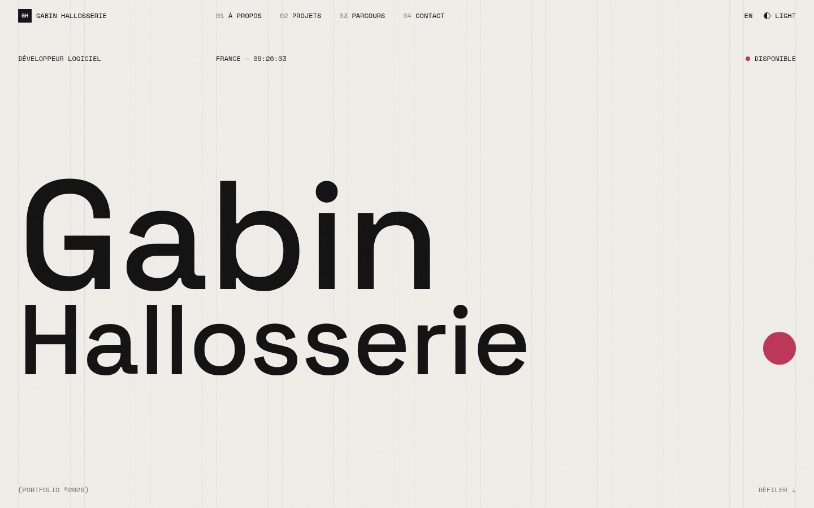
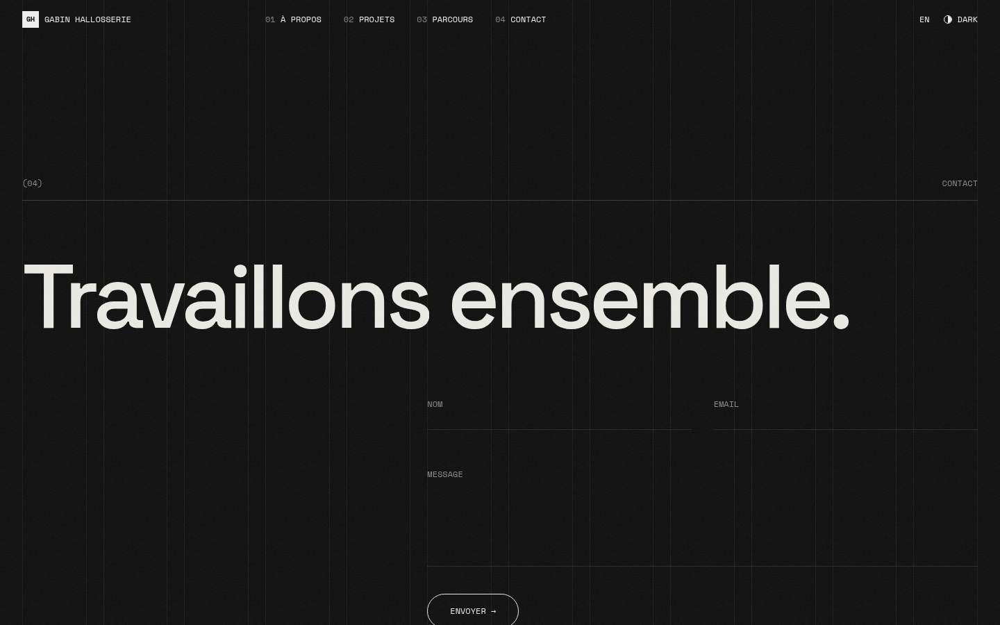
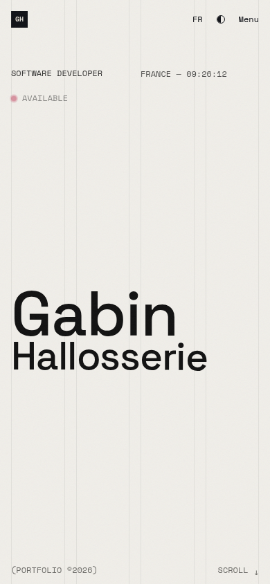

<div align="center">

# Gabin Hallosserie — Portfolio

Développeur full-stack à Castres · co-fondateur de [Rinku Studio](https://rinku-studio.fr) · alternant chez [BeProject](https://www.beproject.fr/).

**[gabin-hallosserie.com](https://gabin-hallosserie.com)**




</div>

## Aperçu

| Thème sombre | Mobile |
| --- | --- |
|  |  |

## Fonctionnalités

**Site public**
- Style suisse : grille visible, Space Grotesk / Space Mono, une couleur d'accent.
- Bilingue EN / FR (`/en`, `/fr`), anglais par défaut, choix mémorisé.
- Thème sombre par défaut, bascule clair / sombre animée.
- Accueil : hero + CTA, bandeau de stack, à propos, projets, parcours, témoignages, contact (prise de RDV optionnelle).
- Projets : index filtrable par tag, aperçu au survol (vignettes sur mobile), détail avec cover, chiffres clés, vidéo, carrousel 16:9 + visionneuse.
- Blog (Markdown, flux RSS), pages Now / Uses / Studio éditables.
- Newsletter Rinku Studio, formulaire de contact anti-spam (honeypot, délai minimal, limite de débit, Turnstile optionnel).
- Palette ⌘K, raccourcis (T thème, L langue, M animations, ? aide), easter egg.

**Animations**
- Transitions natives React `<ViewTransition>` : glissement, rideau, morph du titre et de la cover projet.
- Loader d'intro, curseur avec libellé, boutons magnétiques, grain, Lenis, parallax, textes révélés, barre de lecture.
- Réglage « réduire les animations » + respect de `prefers-reduced-motion`.

**SEO & qualité**
- Images Open Graph générées (accueil, projets, articles), icônes aux couleurs de l'accent, sitemap, robots, JSON-LD, hreflang / canonique.
- Accessibilité : lien d'évitement, focus visible, libellés ARIA (Lighthouse a11y 100).
- Tests Playwright (`npm run test:e2e`) et CI GitHub Actions (lint, types, build, e2e).
- Vercel Analytics + Speed Insights, compteur de vues maison sans cookie.

**Administration (`/admin`)**
- Connexion GitHub OAuth, réservée aux comptes listés dans `public.admins`.
- Réglages : accent, textes, CTA, stack, RDV, compteur de formations, réseaux, CV.
- Projets, parcours, témoignages : réordonnables au glisser-déposer.
- Éditeur Markdown avec aperçu, modèle d'étude de cas, traduction IA FR ⇄ EN.
- Upload avec compression WebP automatique, lien de prévisualisation privé par projet.
- Blog, pages, messages, abonnés (export CSV), statistiques 30 jours.

## Stack

| | |
| --- | --- |
| Framework | Next.js 16 (App Router, `proxy.ts`), React 19, TypeScript |
| Style | Tailwind CSS 4 |
| Animation | Motion, Lenis, View Transitions API |
| Données | Supabase : Postgres + RLS, Auth GitHub, Storage |
| Hébergement | Vercel |

## Structure

```
src/
├── app/
│   ├── [locale]/          # site public FR/EN (accueil, projets, détail)
│   ├── admin/             # panneau d'administration
│   └── auth/callback/     # retour OAuth
├── components/            # UI et animations
├── lib/                   # données, i18n, clients Supabase
└── proxy.ts               # redirection de langue, garde admin
supabase/migrations/       # schéma SQL + RLS
```

## Développement

```bash
npm install
cp .env.example .env.local
npm run dev
```

Variables publiques (voir `.env.example`) :

| Variable | Rôle |
| --- | --- |
| `NEXT_PUBLIC_SUPABASE_URL` | URL du projet Supabase |
| `NEXT_PUBLIC_SUPABASE_PUBLISHABLE_KEY` | Clé publishable (accès limité par la RLS) |
| `NEXT_PUBLIC_SITE_URL` | URL canonique du site |

Variables optionnelles (secrets, à définir dans Vercel) : `ANTHROPIC_API_KEY` (traduction IA), `NOTIFY_WEBHOOK_URL`
(notification Discord / Slack des messages), `NEXT_PUBLIC_TURNSTILE_SITE_KEY` + `TURNSTILE_SECRET_KEY` (anti-spam).

```bash
npm run test:e2e   # tests Playwright (build requis)
```

## Base de données

Schéma dans [`supabase/migrations/0001_init.sql`](supabase/migrations/0001_init.sql) :
`settings` (ligne unique), `projects`, `experiences`, `posts`, `pages`, `testimonials`, `messages`, `subscribers`,
`page_views`, `admins`, bucket public `media`. Migrations dans `supabase/migrations/`.

La RLS autorise la lecture publique et réserve l'écriture à `public.is_admin()`. Les visiteurs peuvent seulement envoyer un message.

Ajouter un administrateur :

```sql
insert into public.admins (login) values ('<login-github>');
```

### Connexion GitHub

1. Créer une OAuth App GitHub, callback `https://<projet>.supabase.co/auth/v1/callback`.
2. Supabase → Authentication → Providers → GitHub : Client ID + Secret.
3. Supabase → Authentication → URL Configuration : Site URL + `/auth/callback` en redirect URL.

## Déploiement

Vercel, branche `main`. Le domaine `gabin-hallosserie.com` pointe vers le projet, `www` redirige vers l'apex.

---

© Gabin Hallosserie
